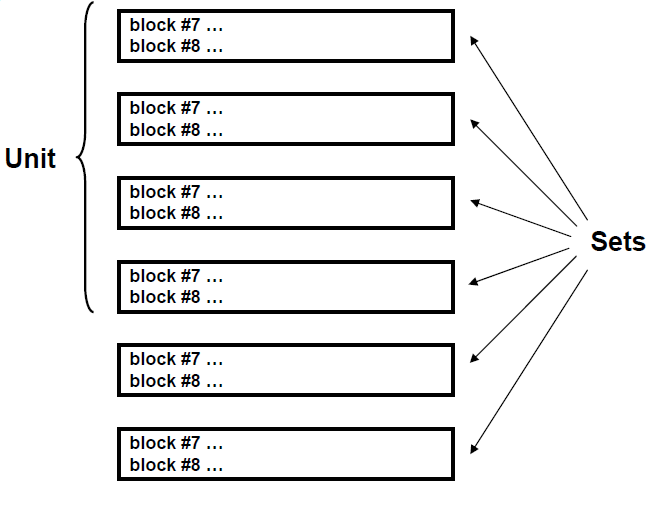

# J. Block #11

The ten cards of this block are read by ACAB as free format. This block tells ACAB firstly about the type of run (for pathway analysis or inventory calculations). It is also used to ask for computing of some particular inventory responses such as waste disposal ratings, contact dose rates, decay heat from different types of radiation, offsite doses and consequences, radiotoxicity and neutron emission. Finally, it allows the user to define the operational scenario (irradiation/cooling history) in terms of a “unit” (for modeling of several identical temporal cycles) and a final series of arbitrary time sets.

## Card #1

|#|Parameter|Description|
|-|---------|-----------|
|1|IWP|Type of ACAB run. Options for UNIT 31 and UNIT 22.<br>- **1** Reading and processing of the decay and cross section libraries. Transition matrix information and some contents from the decay library (such as decay heat, natural isotopic abundance, etc) are written in UNIT 31. This unit can be employed when using inputs files with IWP=3. ACAB can make a run for inventory calculation if the second parameter of this card IMTX is not equal to 1.<br>- **2** Reading UNIT 31, previously generated in runs with IWP=1. Decay and cross sections libraries are not required as inputs. ACAB can proceed for inventory calculations if IMTX is not equal to 1.<br>- **3** Run for pathway analysis. Generates UNIT 22 which gives the number of nuclides on the decay library, the number of non-zero terms on the transition matrix, parents and processes by which  the different isotopes are produced. ACAB execution stops after UNIT 22 is written. This file is required for operation of the CHAINS code (see Section VIII).|
|2|IMTX|Transition matrix option. Generation of UNIT 24.<br>- **0** Run for inventory calculation. No generation of UNIT 24.<br>- **1** Run for pathway analysis. Generates UNIT 24 which contains the elements of the transition matrix. ACAB execution stops after UNIT 24 is written. This binary file is required for operation of the CHAINS code (see Section VIII).<br>- **2** Run for pathway analysis and inventory calculation. UNIT 24 is generated, but ACAB execution continues for a full inventory run. Also UNIT 17 is written, that is a formatted unit basically containing the same information than that of UNIT 24.|
|3|IWDR|Isotopic Waste Disposal Ratings:<br>- **0** No effect.<br>- **1**  Generation of total and isotope-dependent waste disposal ratings. The library file with the specific activity limits data *WD.dat* must be input.|
|4|IDOSE|Dose rate requests:<br>- **0** No effect.<br>- **1** Dose rates estimates are requested - an additional input card must appear. The following libraries must be input: *MACOEF.dat* (mass attenuation coefficient library), *PHOTON.dat* (photon library) and *EBEATA.dat* (beta decay library).|
|5|IPHCUT|Photon energy cutoff options (no effect if IDOSE= 0):<br>- **0** Only include photons with energies > 100 keV.<br>- **1** Use full energy range for photons.|
|6|IDHEAT|Decay heat contributions:<br>- **0** No effect.<br>- **1** Total decay heat, and contributions from beta, gamma, and alpha radiation (precise definitions of beta, gamma, and alpha decay heat can be found in Section IV). The decay heat library file *DHEAT.dat* must be input. Generation of files *DHEAT.out* (containing decay heat results), and *DHEAT.inf* (including information from checking on consistency of decay and decay heat libraries).|
|7|IOFFSD|Offsite dose response functions requests:<br>- **0** No effect.<br>- **N** Dose functions are requested for a number N of distances from discharge point  - additional input cards #3, #4 and #5 can appear. The offsite dose library file *OFFSIDO.dat* must be input. Generation of files *OFFSIDO.out* (containing offside doses and associated effects), and *OFFSIDO.inf* (including information from checking on consistency of decay and offsite dose libraries).|
|8|ICEDE|Commitment effective dose equivalent (CEDE) requests:<br>- **0** No effect.<br>- **1** CEDEs are requested. The CEDE data library *EAF_HAZ.dat* must be input.|
|9|INEMISS|Neutron emission by (alpha,n) and spont. fission requests:<br>- **0** No effect.<br>- **1** Neutron emission  are requested. The following data files must be input: *EAF_STOP_ALP.dat* (differential ranges library for $\alpha$ particles), *EAF_XN_AN.dat* (($(\alpha, n)$) cross section data), *IALPHA.dat* ($\alpha$ decay library) and *ISF.dat* (spontaneous fission decay library).|
|10|IDAMAGE|DPA rate requests:<br>- **0** No effect.<br>- **1** DPAs  are requested. The DAMAGE.dat file must be input.|

## Card #2

Card #2 only appears if IDOSE = 1. Card #2 is used to specify what type of dose rate estimates are desired. Three of the calculated dose rates are contact dose rates that would be experienced at the surface of a semi-infinite media that contained radionuclides in the calculated concentrations. The fourth dose rate is calculated for a very thin layer of material that contains radionuclides in the calculated concentrations.

|#|Parameter|Description|
|-|---------|-----------|
|1|PH|Photon dose rate in Sv/hour.<br>&nbsp;&nbsp;&nbsp;- **0** No dose rate.<br>&nbsp;&nbsp;&nbsp;- **1** Print dose rate.|
|2|BREM|Bremsstrahlung dose rate in Sv/hour.<br>&nbsp;&nbsp;&nbsp;- **0** No dose rate.<br>&nbsp;&nbsp;&nbsp;- **1** Print dose rate.|
|3|TOT|Photon + Bremsstrahlung dose rate in Sv/hour.<br>&nbsp;&nbsp;&nbsp;- **0** No dose rate.<br>&nbsp;&nbsp;&nbsp;- **1** Print dose rate.|
|4|RHOR|Dose rate per unit thickness from a very thin layer (material thickness « photon mean free path in material) in units of Sv/hour–cm.<br>&nbsp;&nbsp;&nbsp;- **0** No dose rate.<br>&nbsp;&nbsp;&nbsp;- **1** Print dose rate.|

## Card #3

Card #3 only appears if IOFFSD ≠ 0.  It is used to specify the distances (in km) from a given release - and associated radial intervals, at which radionuclide release consequence information should be provided.

|#|Parameter|Description|
|-|---------|-----------|
|1|DISTAN|Distances from the release point [IOFFSD]. {IOFFSD  ≠ 0}. Allowed values are any of those used in producing the offsite dose library (see Section IV, Table IV.1).

## Card #4
Card #4 only appears if IOFFSD ≠ 0. It is used to specify the population density to be used in calculation of population dose, early and cancer fatalities. Also it allows specifying release fractions for the different elements.

|#|Parameter|Description|
|-|---------|-----------|
|1|PODE|Population density (km<sup>-2</sup>).|
|2|ILIFR|Option for element release fractions.<br>&nbsp;&nbsp;&nbsp;- **0** Defect option is used (100% release fraction for all elements).<br>&nbsp;&nbsp;&nbsp;- **N** No-defect release fractions are given for N elements.


## Card #5

Card #5 only appears if IOFFSD ≠ 0, and ILIFR ≠ 0. It is used to specify the elements - for which defect release fractions are not appropriate, and their corresponding release fractions.

The format is (IEL(N), FL(N), N=1, ILIFR)
|#|Parameter|Description| 
|-|---------|-----------|
|1|IEL|Atomic number.|
|2|LF|Liberation fraction in %.|

## Card #6
If IDOSE = 0 (card #2 will not appear) and IOFFSD = 0 (cards #3-5 will not be present), card #6 will immediately follow card #1. Complicated irradiation/cooling histories can often be simulated by defining a “unit” of sets that gets repeated a specified number of times. This unit can be followed by a series of additional sets. This allows modeling a scenario consisting of several identical temporal cycles, followed by a final series of time sets. Figure V.1 demonstrates the concept of defining a unit. Card #6 must be specified even when the unit will not be repeated.

|#|Parameter|Description|
|-|---------|-----------|
|1|NOPUL|Number of times to repeat the unit. This means that the number of identical irradiation/cooling cycles involved in the problem is NOPUL+1.|
|2|NTSEQ|Number of sets within a unit. If NOPUL=0, NTSEQ must be set to 0.|
|3|NOTTS|Total number of sets. { NOTTT < 150}. Consequently the final series of sets contains NOTTS-NTSEQ time sets.|
|4|NVFL|Flux scaling factors that allow the reference flux for each set to be scaled. If the scale factor is the same for all sets, using the parameter XNORM is the appropriate input option (block #9)<br>- **0** Flux scaling factors not used.<br>- **1** Flux scaling factors are used and are given on the FVAR variable on card #7.|

## Card #7

When NVFL = 1, the FVAR variable will be given to specify irradiation scaling factors for each irradiation period.

|#|Parameter|Description|
|-|---------|-----------|
|1|FVAR|Flux scaling factor for each set in the unit and for additional sets that follow the unit [NOTTS].<br>FVAR is only required if the scaling factors are different from unity. For pure “cooling” sets FVAR may take any value.|

## Card #8

This card is used to specify the cycles for which inventory data should be stored in an external file for subsequent use, if necessary. The card is specially aimed to model irradiation/cooling histories that can be simulated by defining a “unit” of sets that gets repeated a very large number of times. A typical use of it might be to model the operation of a Inertial Fusion Energy (IFE) power plant that can be operated at 5-10 Hz for around 30 years.

|#|Parameter|Description|
|-|---------|-----------|
|1|NMULT|When the number of cycles done by the code is multiple of NMULT the inventory data at the last time step of the corresponding cycle is written to an external file, Unit 48. If NMULT=0, Unit 48 is not created. This card must appear only if {NOPUL is ≠ 0}.<br>**Note. *We say that a cycle is done, any time that the inventory calculations for all the time steps involved in the “unit” of sets are done.* **

**Example #1**

```plaintext
1 0 0 1 1   0 0
1 1 1 1
149 29 30 1
1.   1.  50. 1.  1.  50.
1.   1. 200. 1.  1.   1.
50.  1.   1. 1. 50.   1.
1. 200.  50. 1.  1.  50.
1.   1.  50. 1.  1. 200.
```

This example requests each of the four dose rates using the full range of photon energies. 29 sets are defined as a unit. The unit is repeated 149 times (149 repetitions + original loop = 150 total times through the unit) and followed by a final set (30 total sets). The specified flux is to be multiplied by factors of 1, 50, and 200 for the various irradiation periods. The flux of the final set is to be multiplied by a factor of 200 (30 scaling factors are given as there are 30 sets). The listing of sets for this example appears in Section VI.

**Example #2**

```plaintext
<Block 7
1 2   1 2   1 0   0 0
<Block 8
1.0000E-6 1.99999E-1
<Block 7
1 10  0 2   1 0   0 0
<Block 8
2.00000E-1 6.000E-1 1.8000E+0 5.4000E+0 1.6200E+1
4.8600E+1 1.4580E+2 4.3740E+2 1.3122E+3 3.6000E+3
<Block 11
1 0 0 1 1 0 0 0 0 0 IWP IMTX IWDR IDOSE IPHCUT IDHEAT IOFFSD ICEDE INEMISS IDAMAGE
1 1 1 1             PH  BREM TOT  RHOR
17998 1 2 0         NOPUL  NTSEQ  NOTTS  NVFL
0                   NMULT
```

Example #2 simulates the operation of an Inertial Fusion Energy (IFE) power plant that is operating at 5 Hz for 1 hour.

In this example, the sets have been shown to provide a full explanation. The first set is defined as a unit. In this case, irradiation takes place over 1 µs, followed by nearly 200 ms of cooling. The unit gets repeated 17998 times for a total of 17999 irradiation/cooling cycles. A final set gives another 1 µs of irradiation and is followed by a series of cooling times. Since each of the irradiation periods is to use the same flux, NVFL = 0 and card #7 is not required.

Note that MSUB = 2 for the first set. This is necessary as each new irradiation will follow the cooling timestep in the previous loop. Also note that the irradiation time on the final set is given as 0.2 seconds. This is done, because the irradiation begins when the cooling ends at 0.199999 seconds in the previous set. The irradiation ending time of 0.2 seconds results in the final irradiation lasting for 1µs.

**Example #3**

```plaintext
<Block 7
2  4   0 4   1 0   0 0
<Block 8
5.0E-04  1.0E-03  9.95E-02  1.99E-01
<Block 9
1.0E-25 1.0E+00
<Block 10
0   0   0
<Block 11
1 0 1 1 1 0 0 0 0 0 IWP IMTX IWDR IDOSE IPHCUT IDHEAT IOFFSD ICEDE INEMISS IDAMAGE
0   0   1    0
215999  1  1  0   0 NOPUL NTSEQ NOTTS NVFL
18000               NMULT
```

This case models the activation of the first structural wall of an IFE power plant operating at 5 Hz for 12 hours. Thus, we have a pulse of 200 ms, with 1ms of on time, and 199 ms of off time. The pulse is described in set defined by block #7 and #8. With only one set that is defined as a unit we can simulate the 12-hours operation. The unit gets repeated 215999 times for a total of 216000 irradiation/cooling cycles. At every hour of operation, that is, every 18000 cycles (NMULT=18000), the corresponding inventory data are stored in unit 48.

The next two examples are aimed to explain how to request the new decay heat and offsite dose  response functions available in ACAB calculations.

**Example #4**

```plaintext
<Block 11
1 0 0 0 0 0 2 0 0 0 IWP IMTX IWDR IDOSE IPHCUT IDHEAT IOFFSD ICEDE INEMISS IDAMAGE
1.5  85.0          (DISTANC(I), I=1,IOFFSD)
100.  2             PODE ILIFR
26 0.5 27 0.25     (IEL(I) , FL(IEL(I)), I=1,IFLI)
4   2   5   0       NOPUL NTSEQ NOTTS NVFL
```

In this case, offsite doses to the Most Exposed Individual are requested for two different distances: 1.5, and 85.0 kilometers. Collective doses and risks are requested for the corresponding population intervals (as defined in the library of offsite response functions, see Section IV, Table IV.1): the first interval ranges from 1.05 to 2 km, and the second from 80 to 90 km. The population density for these intervals is 100 man/km2. Defect release fractions (i.e. 100% release fraction) are assumed for all elements except for two of them: Fe (Z=26), and Co (Z=27). The release fractions for Fe and Co are set to 50%, and 25%, respectively.

**Example #5**

```plaintext
<Block 11
1 0 0 0 0 1 2 0 0 0 IWP IMTX IWDR IDOSE IPHCUT IDHEAT IOFFSD ICEDE INEMISS IDAMAGE
1.5  85.0                (DISTANC(I), I=1,IOFFSD)
100.  0                   PODE ILIFR
<NO CARD  26 0.5 27 0.5  (IEL(I) , FL(IEL(I)), I=1,IFLI)
4   2   5   0             NOPUL NTSEQ NOTTS NVFL
```

In this case, total decay heat as well as decay heat from electron-related radiation, electromagnetic radiation, and heavy charged particles is computed. Offsite doses are also calculated. As ILIFR=0, card #5 is not given. Note that a comment card appears. Comments must be denoted by the symbol < in the first column of the card. A comment card should appear only in front of a numerical card. It may have any arbitrary length.

**Figure V.1. A "set" consists of a card of block #7 and a card of block #8 and is used to specify irradiation and/or cooling timesteps. A "unit" is a collection of sets that may be repeated a specified number of times. The unit may be followed by additional sets.**



**Note:** We say that a cycle is done, each time the inventory calculations for all the timesteps involved in the unit of sets are done.

