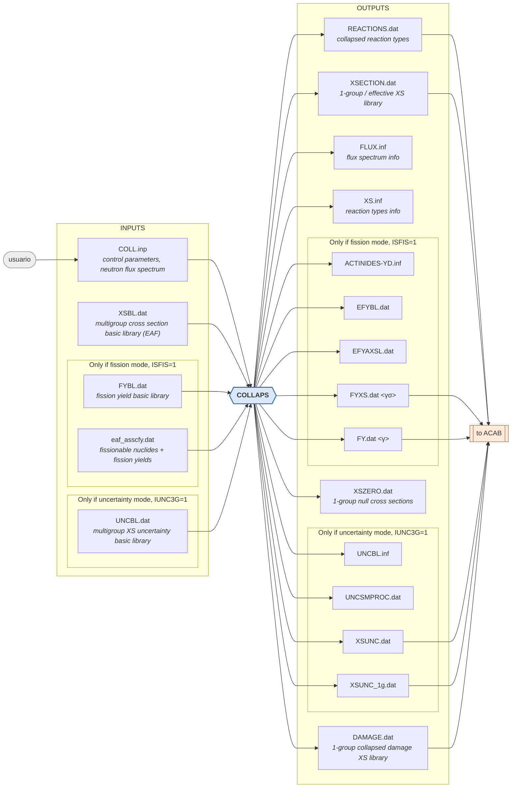

# III. Processing code

## III.1. Processing code COLLAPS

This utility program has five major facilities: i) it is used to condense multigroup activation cross section libraries down to a single group. ii) It also is used to collapse multigroup damage cross section library. iii) COLLAPS can use fission yield data in conjunction with fission cross sections and neutron spectrum to compute effective fission yield cross sections, <$\gamma\sigma$>, and effective fission yields, <$\gamma$>. iv) The code can be used to collapse cross section uncertainty data for a particular neutron spectrum. $\nu$) Finally, it can create a pseudo cross section library according with the weighting function provided by the user (this feature is clarified in Section VI, Subsection H).

Two basic parameters control the different operation modes of COLLAPS: ISFIS and IUNC3G. When running COLLAPS in the mode ISFIS=0, that we call hereafter "standard mode", the neutron flux is used as a weighting function to produce the 1-group energy-averaged ("effective") cross-sections. The neutron spectrum may be input in an arbitrary group structure. When the code runs with ISFIS=1, mode that will be referred to as "fission mode" hereafter, the same former library is produced, but in addition two new libraries are generated: one containing 1-group effective fission product yields, and other including 1-group effective fission yield cross sections. When running COLLAPS with IUNC3G=1 (regardless of the ISFIS value), the code use the cross-section uncertainty data in conjunction with cross sections and neutron spectrum to produce a library containing for every nuclide cross sections and uncertainty data in a consistent group structure. When IUNC3G=0, no cross section uncertainty information is processed.

Regarding the operation of COLLAPS in the standard mode, the cross section libraries to be "collapsed" must be in the format used by the European Activation File (EAF). In the case of collapsing a multigroup damage cross section library, the damage energy cross sections have to be also in EAF format.

COLLAPS currently is able to handle cross section libraries in the standard Vitamin-J (175 groups), GAM-II (100 groups), TART-175 (175 groups), TART-566 (566 groups) and Vitamin-J+ (211 groups) group structures. The three first group structures are given in Tables III.1-III.3. The fourth structure is coming from a 650 group structure aimed to be used with the TART98 Monte Carlo neutron and photon transport code. This structure has minimum neutron energy of $10^{-10}$ MeV and maximum neutron energy of 1 GeV. The energies are divided logically into the 650 groups with a standard distribution of 50 groups per decade. The number of groups below 20 MeV is 566. Between 1 and 20 MeV there are 16 groups. The fifth group structure (Vitamin-J+) is an extended structured from Vitamin-J up to 55 MeV. From 20 MeV to 55 MeV, the energy range is divided into 36 groups, at 1 MeV intervals.

The ability to deal with libraries in other group structures can be easily implemented in COLLAPS. The neutron spectrum employed to condense the cross section library, if possible, is advised to be in one of those structures. When the neutron spectrum is given in a group structure different from those listed above, COLLAPS begins by converting the spectrum into one of the standard structures (as specified by the user). After conversion is completed, the code condenses the cross section library.

When ACAB is going to be run for inventory calculations considering fission products, previously to run it, the user must run COLLAPS with the option ISFIS=1, since ACAB needs as input the 1-group fission yield or fission yield cross section library output by COLLAPS. When the inventory of fission products is not to be computed by ACAB, the user is recommended to use COLLAPS with the option ISFIS=0.

When COLLAPS operates in the fission mode, one of the important computed quantities is the effective fission yield cross section <$\gamma\sigma$>. This is defined as the spectrum-averaged neutron cross section for formation of nuclei of type i by fission in the nuclei of type j, and may be expressed as:

$$ \langle \gamma_{j,i} \sigma_{f,j} \rangle = \frac{\int_{0}^{\infty} \gamma_{j,i}(E) \sigma_{f,j}(E) \phi(E) dE}{\phi_T} $$

where,

$ \gamma_{j,i} $ = probability that a type-i nuclide will be formed as a fission product by absorption of a neutron of energy E by a nuclide of type j.

$ \sigma_{f,j} $ = microscopic fission cross section of type j nuclei for neutrons of energy E.

$ \phi_T $ = total energy integrated neutron flux.

Other important quantity computed is the *effective fission product yield* <$\gamma$>. This is defined as the spectrum-averaged fission yield for formation of nuclei of type i by fission in the nuclei of type j, and may be expressed as:

$$\langle \gamma_{j,i} \rangle = \frac{\int_{0}^{\infty} \gamma_{j,i}(E) \sigma_{f,j}(E) \phi(E) dE}{\int_{0}^{\infty} \sigma_{f,j}(E) \phi(E) dE}$$

that is:
$$\langle \gamma_{j,i} \rangle = \frac{\langle \gamma_{j,i} \sigma_{f,j} \rangle}{\langle \sigma_{f,j} \rangle}$$

In previous versions of ACAB, the effective fission yield cross section library was used. In the current version, the option to use the library of effective fission product yields is also available, which is especially convenient when using ACAB for computing uncertainties in inventory calculations.

In computing the above mentioned quantities, some assumptions are made to deal with the information from the JEF-2.2/JEFF3.1 fission yield library:

- i) Three energy regions are defined, assuming that independent yield data are constant in the energy range of each region. The energy ranges for these regions should be provided by the user (card #4 of COLLAPS input), and the ranges recommended are: E<200 keV (low energy region), 5 MeV>E>200 keV (medium energy region), and E>5 MeV (high energy region). These regions have been selected taking into account the three neutron incident energy points for yield data considered in JEF-2.2/JEFF3.1, that is: $\gamma$ at 0.0253 eV, $\gamma$ at 0.4 MeV and $\gamma$ at 14 MeV. Consequently, fission yields at these points are assigned to the low, medium and high energy regions, respectively.
- ii) For some of the fissionable nuclides considered in JEF-2.2/JEFF3.1, yield data are not given for all of the three energy points, even though the fission cross section is not negligible for the neutron having the energy of a missing point. To work out this situation we have assigned to an energy point lacking yield data, the yield data of the closer one.
- iii) In JEF-2.2/JEFF3.1 there are 19 fissionable nuclides, while in the activation library FENDL/A-2.0 there are 61 nuclides having fission cross sections, 90 in EAF-2005 and 102 in EAF-2007. COLLAPS allows obtaining <$\gamma\sigma$> and <$\gamma$> files for both 19 and 61/90/102 nuclides. In producing the corresponding files, the nuclides with no fission yield data in JEF-2.2/JEFF3.1 were assumed in previous versions to have those of the neighboring nuclide with fission yields available. In this version, we have used the INPUT file *eaf_asscfy.dat* to link between fissionable nuclides and fission yields.

When COLLAPS operates in the IUNC3G=1 mode, the effective cross sections are computed for each nuclide and for each of the energy regions considered in the uncertainty cross-section data library. The joint cross section and uncertainty collapsed library is produced.

COLLAPS is controlled via the standard input unit 5 (file named COLL.inp). Unit 2 (file XSBL.dat) must contain the cross section basic library to be condensed. Unit 17 (file FYBL.dat) includes the fission yield basic library. The code also reads the cross-section uncertainty basic library (unit 4, file UNCBL.dat).

Output is automatically written to different files described in the COLLAPS flowchart. Unit 9 (file XSECTION.dat) contains the 1-group cross section library in the EAF format, unit 8 (file FLUX.inf) gives the 1-group neutron flux and average neutron energy, and unit 12 (file REACTIONS.dat) contains the reaction types and reaction codes to be used by ACAB (in NUDATA.f subroutine) and by CHAINS code.

When running in the fission mode, COLLAPS reads the FYBL.dat library and processes it into the hereafter called *extended fission yield library* (EFYL), which contains the independent fission yields for all the three energy points, and for the fissionable nuclides included in the library (file EFYBL.dat) or in the activation cross section library (file EFYAXSL.dat). The EFY library is not dependent on the weighting neutron spectrum and therefore, once generated, it can be used directly in subsequent runs of COLLAPS, as input file containing the fission yield information, instead of using the basic fission yield library (unit 17). Also unit 96 is generated containing the one-group fission yield cross section library (file FYXSL.dat) and the one-group fission yield library (file FYL.dat).

When the IUNC3G=1 mode is active, the joint cross section and uncertainty collapsed libraries are generated (unit 66): in the same group structure than that of UNCBL.dat (file XSUNC.dat) and in one energy group (XSUNC_1G.dat).

If a multigroup damage library is used [Cabellos, 2007], the collapsed damage cross section is written in file DAMAGE.dat. This file includes the following information: isotope/element, collapsed damage cross section, default damage displacement energy, and collapsed gas production cross section (hydrogen, deuterium, tritium, He3 and He4).

**<u>INPUT FILE</u>**

The input file, unit 5, is formatted and must contain the following information:

**Card #1**: (format is 2I4)

The first card is used to specify the group structure of both the cross section library and the neutron flux.

|#|Parameter|Description|
|-|---------|-----------|
| **1** | ILIB | Group structure used in the cross section library:<br>1. GAM-II (100 groups)<br>2. Vitamin-J (175 groups)<br>3. TART-175 (175 groups)<br>4. TART-566 (175 groups)<br>5. Other (arbitrary)<br>12. Vitamin-J+ (211 groups) |
| **2** | IESF | Group structure used for the neutron flux:<br>1. GAM-II<br>2. Vitamin-J<br>3. TART-175<br>4. TART-566<br>5. Other (arbitrary)<br>12. Vitamin-J+ (211 groups) |

**Card #2:** (FORTRAN free format)

This card is used for reading the information heading the activation cross- section library.

|#|Parameter|Description|
|-|---------|-----------|
|**1**|IHEAD|Number of lines heading the cross section library. This heading provide general library information.|

**Card #3:** (FORTRAN free format)

This card controls the generation of the effective fission yield cross section library. If the first parameter of this card is 0, the rest will not have any effect and can take any value.

|#|Parameter|Description|
|-|---------|-----------|
|1|ISFIS|Indicator for the fission mode operation.<br>0. No effect. The other parameters of this card don't have any effect if ISFIS=0.<br>1.  Fission yield data are processed (according to ISOCA, parameter #3 of this card).|
|2|IGEN|Indicator for controlling the generation of the *extended* fission yield (EFY) library.<br>0. No effect. Standard fission mode of operation is active to cause the generation of the effective fission yield cross section library.<br>1. • Generation of file EFYBL.dat, which includes the "extended" fission yield data library for all fissionable nuclides included in the basic (UNIT 17) fission yield data library.<br>• Generation of file EFYAXSL.dat, which contains the extended fission yield data library for all fissionable nuclides included in the reaction cross section data library.<br>• After the generation of the both files, the code STOPS. No effective fission yield cross section library is generated. The EFY libraries produced can be used in subsequent runs (with ISOCA=0) instead of input, as starting point, e.g. the JEF-2.2 library. |
|3|ISOCA|Processing of the basic fission yield data library (UNIT 17).<br>0. No effect. The code reads the extended fission yield data library (it must appear as UNIT #18).<br>1. Reading and processing of the basic fission yield data library (it must appear as UNIT #17).|
|4|IBEST|Selection of the 1-group (or effective) fission yield cross section library (UNIT 96). It is ignored if IGEN=1.<br>0. The fission yield cross section library is generated for the fissionable nuclides included in the original fission yield data library (UNIT 17).<br>1. The library is produced for all fissionable nuclides included in the reaction cross section library (UNIT 2).|

Example #1:

```text
0 0/1 0/1 0/1
```

This example keeps COLLAPS from dealing with fission yield data information (ISFIS=0, and the rest of the parameters are ignored).

Example #2:

```text
1 1 1 0/1
```

This example causes processing of fission yield data (ISFIS=1) taken from JEFF- 2.2/UNIT #17 (ISOCA =1), and production of EFY libraries for 19 (Unit 18) and 61 (Unit 28) fissionable nuclides (IGEN =1). No fission yield cross sections are generated, so the parameter IBEST is ignored.

Example #3:

```text
1 0 1 0
```

This example causes processing of fission yield data (ISFIS=1) taken from JEFF- 2.2/UNIT #17 (ISOCA =1), and production of both (IGEN =0) the EFY library (Unit 18) and the 1-group fission yield cross section library (Unit 96), corresponding to the fissionable nuclides included in JEF-2.2 (IBEST =0).

Example #4:

```text
1 0 1 1
```

This example differs from Ex. #3 only in the parameter IBEST. Here the produced units #18 and #96 corresponds to the fissionable nuclides included in the activation cross section library (IBEST =1).

Example #5:

```text
1 0 0 0
```

This example causes processing of fission yield data (ISFIS=1) taken from a previous produced EFY library/UNIT #18 (ISOCA =0), and production (IGEN =0) of the 1-group fission yield cross section library (Unit 96) corresponding to the fissionable nuclides included in the input EFY library/UNIT #18. Here, Unit 18 must contain information for the fissionable nuclides contained in JEF-2.2 (IBEST =0).

Example #6:

```text
1001
```

This example differs from Ex. #5 only in the parameter IBEST. Here the input EFY library/UNIT #18 must contain information for the fissionable nuclides included in the activation cross section library (IBEST =1).

**Card #4:** (FORTRAN free format)

This card will only be present if ISFIS <> 0. It gives the fission yield energy group structure for processing of the JEF-2.2 fission yield library. Independent yield data are assumed to be constant in each energy group.

|#|Parameter|Description|
|-|---------|-----------|
|1|EB|Energy boundaries (eV) of the energy regions where independent yield data are assumed to be constant. The energy boundaries are given in order of decreasing energy [2].<br> The energy boundaries for the 3-group structure are: 14 Mev-EB(1), EB(1)-EB(2), and EB(2)-0.0253MeV. The values suggested are 5 MeV for EB(1) and 200 keV for EB(2).|

**Card #5:** (format is 2I4)
This card gives the number of groups used in the neutron spectrum and the units of the neutron flux.

|#|Parameter|Description|
|-|---------|-----------|
|1|NGROUP|The absolute value of NGROUP is the number of neutron groups of the neutron spectrum.<br>If NGROUP < 0, the neutron flux group structure is given in order of decreasing energy.<br>If NGROUP > 0, the neutron flux group structure is given in order of increasing energy.|
|2|FF|Units used for the neutron flux description:<br>0. Total scalar flux [n/cm2-s]<br>1. Flux density [n/cm2-s-MeV]|

**Card #6:**(format is 6E12.5)

Card #6 will only appear if IESF=5, that is, when a group structure other than GAM-II, Vitamin-J, TART-175, or TART-566 is used to specify the neutron flux.

|#|Parameter|Description|
|-|---------|-----------|
|1|CX|Energy boundaries of the group structure used for the neutron flux. The order of the energy boundaries is given by the sign of NGROUP.[NGROUP+1].|

**Card #7:** (format is 6E12.5)

When IESF <> 4, card #6 will not appear, and thus, card #7 will immediately follow card #5.


|#|Parameter|Description|
|-|---------|-----------|
|1|FT|Flux levels within each energy group. Units of the flux are given by FF and order (ascending or descending energy) is fix by the sign of NGROUP [ABS(NGROUP)].|

**Card #8:** (FORTRAN free format)

It allows processing of the basic uncertainty data library, file UNBL.dat.

|#|Parameter|Description|
|-|---------|-----------|
|1|IUNC3G|Option for dealing with cross-section uncertainties.<br>0. No effect.<br>1. Production of the joint cross-section and uncertainty collapsed libraries (files XSUNC.dat and XSUNC_1G.dat).|

**Card #9:** (FORTRAN free format)

|#|Parameter|Description|
|-|---------|-----------|
|1|ISTOP|Option for printing only flux information.<br>0. No effect.<br>1. The code only writes the file FLUX.inf.|

Example of input file:

```text
2 3
16
1 0 1 1
5.E+06 2.E+05
-175 0
1.00000E+00 1.00000E+00 1.00000E+00 1.00000E+00 1.00000E+00 1.00000E+00
1.00000E+00 1.00000E+00 1.00000E+00 1.00000E+00 1.00000E+00 1.00000E+00
1.00000E+00 1.00000E+00 1.00000E+00 1.00000E+00 1.00000E+00 1.00000E+00
1.00000E+00 1.00000E+00 1.00000E+00 1.00000E+00 1.00000E+00 1.00000E+00
1.00000E+00 1.00000E+00 1.00000E+00 1.00000E+00 1.00000E+00 1.00000E+00
1.00000E+00 1.00000E+00 1.00000E+00 1.00000E+00 1.00000E+00 1.00000E+00
1.00000E+00 1.00000E+00 1.00000E+00 1.00000E+00 1.00000E+00 1.00000E+00
1.00000E+00 1.00000E+00 1.00000E+00 1.00000E+00 1.00000E+00 1.00000E+00
1.00000E+00 1.00000E+00 1.00000E+00 1.00000E+00 1.00000E+00 1.00000E+00
1.00000E+00 1.00000E+00 1.00000E+00 1.00000E+00 1.00000E+00 1.00000E+00
1.00000E+00 1.00000E+00 1.00000E+00 1.00000E+00 1.00000E+00 1.00000E+00
1.00000E+00 1.00000E+00 1.00000E+00 1.00000E+00 1.00000E+00 1.00000E+00
1.00000E+00 1.00000E+00 1.00000E+00 1.00000E+00 1.00000E+00 1.00000E+00
1.00000E+00 1.00000E+00 1.00000E+00 1.00000E+00 1.00000E+00 1.00000E+00
1.00000E+00 1.00000E+00 1.00000E+00 1.00000E+00 1.00000E+00 1.00000E+00
1.00000E+00 1.00000E+00 1.00000E+00 1.00000E+00 1.00000E+00 1.00000E+00
1.00000E+00 1.00000E+00 1.00000E+00 1.00000E+00 1.00000E+00 1.00000E+00
1.00000E+00 1.00000E+00 1.00000E+00 1.00000E+00 1.00000E+00 1.00000E+00
1.00000E+00 1.00000E+00 1.00000E+00 1.00000E+00 1.00000E+00 1.00000E+00
1.00000E+00 1.00000E+00 1.00000E+00 1.00000E+00 1.00000E+00 1.00000E+00
1.00000E+00 1.00000E+00 1.00000E+00 1.00000E+00 1.00000E+00 1.00000E+00
1.00000E+00 1.00000E+00 1.00000E+00 1.00000E+00 1.00000E+00 1.00000E+00
1.00000E+00 1.00000E+00 1.00000E+00 1.00000E+00 1.00000E+00 1.00000E+00
1.00000E+00 1.00000E+00 1.00000E+00 1.00000E+00 1.00000E+00 1.00000E+00
1.00000E+00 1.00000E+00 1.00000E+00 1.00000E+00 1.00000E+00 1.00000E+00
1.00000E+00 1.00000E+00 1.00000E+00 1.00000E+00 1.00000E+00 1.00000E+00
1.00000E+00 1.00000E+00 1.00000E+00 1.00000E+00 1.00000E+00 1.00000E+00
1.00000E+00 1.00000E+00 1.00000E+00 1.00000E+00 1.00000E+00 1.00000E+00
1.00000E+00 1.00000E+00 1.00000E+00 1.00000E+00 1.00000E+00 1.00000E+00
1.00000E+00
IUNC3G
ISTOP
```

In the above example, the neutron flux is given in TART 175-group format while the activation cross sections are given in VITAMIN 175-group format. The number 16 means that there are 16 heading lines in FENDL-A/2.0. The parameters of the next card are: ISFIS=1 (meaning that ACAB is going to run in "fission mode"), IGEN=0 (this is a “standard fission mode of operation", and the effective fission yields cross section library is generated), ISOCA=1 (in this case the basic fission yield data library JEF-2.2 is processed) and IBEST=1 (both, the effective fission yield cross section and the EFY libraries are generated for all fissionable nuclides contained in the activation library). The next card shows the energy boundaries limiting the three regions considered in fission yield processing (the two values are those suggested in card #4). In the following card, the negative sign in front of the figure 175 indicates that the fluxes will follow in order of descending energy. The fluxes are given in units of n/cm2-s as indicated by FF = 0. Because IESF # 5, card #6 is omitted, and the 175 fluxes immediately follow card #5. The card IUNC3G=0, indicates that cross section uncertainty processing should not be performed. The final card, ISTOP=0, indicates that all the processing activities are to be done.



Figure III.1. COLLAPS flowchart.

**Table III.1. Energy group boundaries for the Vitamin-J 175-group structure.** The upper energy for group #1 is 19.6 MeV. A modified VITAMINJ data is available in 211-group (extending up to 55MeV)

|Group #|$E_{min}$ (Mev)|Group #|$E_{min}$ (Mev)|Group #|$E_{min}$ (Mev)|Group #|$E_{min}$ (Mev)|
|-------|-------|-------|-------|-------|-------|-------|-------|
|1|1.73E+01|46|2.31E+00|91|2.13E-01|136|2.61E-03|
|2|1.69E+01|47|2.23E+00|92|2.02E-01|137|2.49E-03|
|3|1.65E+01|48|2.12E+00|93|1.93E-01|138|2.25E-03|
|4|1.57E+01|49|2.02E+00|94|1.83E-01|139|2.03E-03|
|5|1.49E+01|50|1.92E+00|95|1.74E-01|140|1.58E-03|
|6|1.46E+01|51|1.83E+00|96|1.66E-01|141|1.23E-03|
|7|1.42E+01|52|1.74E+00|97|1.58E-01|142|9.61E-04|
|8|1.38E+01|53|1.65E+00|98|1.50E-01|143|7.49E-04|
|9|1.35E+01|54|1.57E+00|99|1.43E-01|144|5.83E-04|
|10|1.28E+01|55|1.50E+00|100|1.36E-01|145|4.54E-04|
|11|1.25E+01|56|1.42E+00|101|1.29E-01|146|3.54E-04|
|12|1.22E+01|57|1.35E+00|102|1.23E-01|147|2.75E-04|
|13|1.16E+01|58|1.29E+00|103|1.17E-01|148|2.14E-04|
|14|1.11E+01|59|1.22E+00|104|1.11E-01|149|1.67E-04|
|15|1.05E+01|60|1.16E+00|105|9.80E-02|150|1.30E-04|
|16|1.00E+01|61|1.11E+00|106|8.65E-02|151|1.01E-04|
|17|9.51E+00|62|1.00E+00|107|8.25E-02|152|7.89E-05|
|18|9.05E+00|63|9.62E-01|108|7.95E-02|153|6.14E-05|
|19|8.61E+00|64|9.07E-01|109|7.20E-02|154|4.79E-05|
|20|8.19E+00|65|8.63E-01|110|6.74E-02|155|3.73E-05|
|21|7.79E+00|66|8.21E-01|111|5.66E-02|156|2.90E-05|
|22|7.41E+00|67|7.81E-01|112|5.25E-02|157|2.26E-05|
|23|7.05E+00|68|7.43E-01|113|4.63E-02|158|1.76E-05|
|24|6.70E+00|69|7.07E-01|114|4.09E-02|159|1.37E-05|
|25|6.59E+00|70|6.72E-01|115|3.43E-02|160|1.07E-05|
|26|6.38E+00|71|6.39E-01|116|3.18E-02|161|8.32E-06|
|27|6.07E+00|72|6.08E-01|117|2.85E-02|162|6.48E-06|
|28|5.77E+00|73|5.78E-01|118|2.70E-02|163|5.04E-06|
|29|5.49E+00|74|5.50E-01|119|2.61E-02|164|3.93E-06|
|30|5.22E+00|75|5.23E-01|120|2.48E-02|165|3.06E-06|
|31|4.97E+00|76|4.98E-01|121|2.42E-02|166|2.38E-06|
|32|4.72E+00|77|4.50E-01|122|2.36E-02|167|1.86E-06|
|33|4.49E+00|78|4.08E-01|123|2.19E-02|168|1.45E-06|
|34|4.07E+00|79|3.88E-01|124|1.93E-02|169|1.13E-06|
|35|3.68E+00|80|3.69E-01|125|1.50E-02|170|8.76E-07|
|36|3.33E+00|81|3.34E-01|126|1.17E-02|171|6.83E-07|
|37|3.17E+00|82|3.02E-01|127|1.06E-02|172|5.32E-07|
|38|3.01E+00|83|2.98E-01|128|9.12E-03|173|4.14E-07|
|39|2.87E+00|84|2.97E-01|129|7.10E-03|174|1.00E-07|
|40|2.73E+00|85|2.95E-01|130|5.53E-03|175|1.00E-11|
|41|2.59E+00|86|2.87E-01|131|4.31E-03|||
|42|2.47E+00|87|2.73E-01|132|3.71E-03|||
|43|2.39E+00|88|2.47E-01|133|3.35E-03|||
|44|2.37E+00|89|2.35E-01|134|3.04E-03|||
|45|2.35E+00|90|2.24E-01|135|2.75E-03|||

**Table III.2. Energy group boundaries for the GAM-II 100-group structure**. The upper energy for group #1 is 14.9 MeV

| Group # | \(E_{min}\) (Mev) | Group # | \(E_{min}\) (Mev) | Group # | \(E_{min}\) (Mev) |
| :---: | :---: | :---: | :---: | :---: | :---: |
| 1 | 1.35E+01 | 36 | 4.08E-01 | 71 | 4.54E-04 |
| 2 | 1.22E+01 | 37 | 3.69E-01 | 72 | 3.54E-04 |
| 3 | 1.11E+01 | 38 | 3.34E-01 | 73 | 2.75E-04 |
| 4 | 1.00E+01 | 39 | 3.02E-01 | 74 | 2.14E-04 |
| 5 | 9.05E+00 | 40 | 2.73E-01 | 75 | 1.67E-04 |
| 6 | 8.19E+00 | 41 | 2.47E-01 | 76 | 1.30E-04 |
| 7 | 7.41E+00 | 42 | 2.24E-01 | 77 | 1.01E-04 |
| 8 | 6.70E+00 | 43 | 2.02E-01 | 78 | 7.89E-05 |
| 9 | 6.07E+00 | 44 | 1.83E-01 | 79 | 6.14E-05 |
| 10 | 5.49E+00 | 45 | 1.66E-01 | 80 | 4.79E-05 |
| 11 | 4.97E+00 | 46 | 1.50E-01 | 81 | 3.73E-05 |
| 12 | 4.49E+00 | 47 | 1.36E-01 | 82 | 2.90E-05 |
| 13 | 4.07E+00 | 48 | 1.23E-01 | 83 | 2.26E-05 |
| 14 | 3.68E+00 | 49 | 1.11E-01 | 84 | 1.76E-05 |
| 15 | 3.33E+00 | 50 | 8.65E-02 | 85 | 1.37E-05 |
| 16 | 3.01E+00 | 51 | 6.74E-02 | 86 | 1.07E-05 |
| 17 | 2.73E+00 | 52 | 5.25E-02 | 87 | 8.32E-06 |
| 18 | 2.47E+00 | 53 | 4.09E-02 | 88 | 6.48E-06 |
| 19 | 2.23E+00 | 54 | 3.18E-02 | 89 | 5.04E-06 |
| 20 | 2.02E+00 | 55 | 2.48E-02 | 90 | 3.93E-06 |
| 21 | 1.83E+00 | 56 | 1.93E-02 | 91 | 3.06E-06 |
| 22 | 1.65E+00 | 57 | 1.50E-02 | 92 | 2.38E-06 |
| 23 | 1.50E+00 | 58 | 1.17E-02 | 93 | 1.86E-06 |
| 24 | 1.35E+00 | 59 | 9.12E-03 | 94 | 1.45E-06 |
| 25 | 1.22E+00 | 60 | 7.10E-03 | 95 | 1.13E-06 |
| 26 | 1.11E+00 | 61 | 5.53E-03 | 96 | 8.76E-07 |
| 27 | 1.00E+00 | 62 | 4.31E-03 | 97 | 6.83E-07 |
| 28 | 9.07E-01 | 63 | 3.35E-03 | 98 | 5.32E-07 |
| 29 | 8.21E-01 | 64 | 2.61E-03 | 99 | 4.14E-07 |
| 30 | 7.43E-01 | 65 | 2.03E-03 | 100 | 5.10E-09 |
| 31 | 6.72E-01 | 66 | 1.58E-03 | | |
| 32 | 6.08E-01 | 67 | 1.23E-03 | | |
| 33 | 5.50E-01 | 68 | 9.61E-04 | | |
| 34 | 4.98E-01 | 69 | 7.49E-04 | | |
| 35 | 4.50E-01 | 70 | 5.83E-04 | | |

**Table III.3. Energy group boundaries for the TART 175-group structure.** The upper energy for group #1 is 20.0 MeV

| Group # | \(E_{min}\) (MeV) | Group # | \(E_{min}\) (MeV) | Group # | \(E_{min}\) (MeV) | Group # | \(E_{min}\) (MeV) |
| :---: | :---: | :---: | :---: | :---: | :---: | :---: | :---: |
| 1 | 1.88E+01 | 46 | 1.51E+00 | 91 | 5.66E-04 | 136 | 3.87E-05 |
| 2 | 1.81E+01 | 47 | 1.34E+00 | 92 | 4.99E-04 | 137 | 3.60E-05 |
| 3 | 1.75E+01 | 48 | 1.18E+00 | 93 | 4.70E-04 | 138 | 3.35E-05 |
| 4 | 1.69E+01 | 49 | 1.03E+00 | 94 | 3.81E-04 | 139 | 3.10E-05 |
| 5 | 1.63E+01 | 50 | 8.83E-01 | 95 | 3.27E-04 | 140 | 2.94E-05 |
| 6 | 1.58E+01 | 51 | 7.53E-01 | 96 | 2.74E-04 | 141 | 2.86E-05 |
| 7 | 1.52E+01 | 52 | 6.33E-01 | 97 | 2.09E-04 | 142 | 2.71E-05 |
| 8 | 1.47E+01 | 53 | 5.12E-01 | 98 | 1.99E-04 | 143 | 2.56E-05 |
| 9 | 1.44E+01 | 54 | 4.23E-01 | 99 | 1.89E-04 | 144 | 2.42E-05 |
| 10 | 1.41E+01 | 55 | 3.78E-01 | 100 | 1.79E-04 | 145 | 2.28E-05 |
| 11 | 1.39E+01 | 56 | 3.35E-01 | 101 | 1.69E-04 | 146 | 2.08E-05 |
| 12 | 1.35E+01 | 57 | 2.94E-01 | 102 | 1.60E-04 | 147 | 1.88E-05 |
| 13 | 1.31E+01 | 58 | 2.71E-01 | 103 | 1.51E-04 | 148 | 1.76E-05 |
| 14 | 1.25E+01 | 59 | 2.42E-01 | 104 | 1.41E-04 | 149 | 1.58E-05 |
| 15 | 1.20E+01 | 60 | 2.08E-01 | 105 | 1.34E-04 | 150 | 1.47E-05 |
| 16 | 1.16E+01 | 61 | 1.82E-01 | 106 | 1.26E-04 | 151 | 1.31E-05 |
| 17 | 1.10E+01 | 62 | 1.31E-01 | 107 | 1.18E-04 | 152 | 1.10E-05 |
| 18 | 1.06E+01 | 63 | 9.89E-02 | 108 | 1.10E-04 | 153 | 9.62E-06 |
| 19 | 1.01E+01 | 64 | 8.32E-02 | 109 | 1.03E-04 | 154 | 8.32E-06 |
| 20 | 9.67E+00 | 65 | 7.00E-02 | 110 | 9.81E-05 | 155 | 6.74E-06 |
| 21 | 9.18E+00 | 66 | 5.76E-02 | 111 | 9.67E-05 | 156 | 5.66E-06 |
| 22 | 8.79E+00 | 67 | 4.70E-02 | 112 | 9.39E-05 | 157 | 4.70E-06 |
| 23 | 8.32E+00 | 68 | 3.95E-02 | 113 | 9.11E-05 | 158 | 3.53E-06 |
| 24 | 7.91E+00 | 69 | 3.27E-02 | 114 | 8.83E-05 | 159 | 2.74E-06 |
| 25 | 7.55E+00 | 70 | 2.65E-02 | 115 | 8.43E-05 | 160 | 2.09E-06 |
| 26 | 7.16E+00 | 71 | 2.09E-02 | 116 | 8.17E-05 | 161 | 1.51E-06 |
| 27 | 6.74E+00 | 72 | 1.51E-02 | 117 | 7.91E-05 | 162 | 1.18E-06 |
| 28 | 6.37E+00 | 73 | 1.03E-02 | 118 | 7.73E-05 | 163 | 7.53E-07 |
| 29 | 6.04E+00 | 74 | 7.53E-03 | 119 | 7.53E-05 | 164 | 5.12E-07 |
| 30 | 5.66E+00 | 75 | 5.76E-03 | 120 | 7.16E-05 | 165 | 4.23E-07 |
| 31 | 5.35E+00 | 76 | 4.23E-03 | 121 | 7.03E-05 | 166 | 3.35E-07 |
| 32 | 4.99E+00 | 77 | 3.78E-03 | 122 | 6.67E-05 | 167 | 2.56E-07 |
| 33 | 4.70E+00 | 78 | 3.35E-03 | 123 | 6.56E-05 | 168 | 1.88E-07 |
| 34 | 4.40E+00 | 79 | 2.94E-03 | 124 | 6.39E-05 | 169 | 1.31E-07 |
| 35 | 4.07E+00 | 80 | 2.56E-03 | 125 | 6.10E-05 | 170 | 8.32E-08 |
| 36 | 3.81E+00 | 81 | 2.21E-03 | 126 | 5.76E-05 | 171 | 4.70E-08 |
| 37 | 3.53E+00 | 82 | 1.88E-03 | 127 | 5.65E-05 | 172 | 3.27E-08 |
| 38 | 3.27E+00 | 83 | 1.58E-03 | 128 | 5.33E-05 | 173 | 2.09E-08 |
| 39 | 3.01E+00 | 84 | 1.31E-03 | 129 | 5.12E-05 | 174 | 5.23E-09 |
| 40 | 2.74E+00 | 85 | 1.06E-03 | 130 | 4.92E-05 | 175 | 1.31E-09 |
| 41 | 2.53E+00 | 86 | 9.18E-04 | 131 | 4.72E-05 | | |
| 42 | 2.31E+00 | 87 | 8.32E-04 | 132 | 4.62E-05 | | |
| 43 | 2.09E+00 | 88 | 7.16E-04 | 133 | 4.33E-05 | | |
| 44 | 1.89E+00 | 89 | 6.37E-04 | 134 | 4.23E-05 | | |
| 45 | 1.69E+00 | 90 | 6.04E-04 | 135 | 4.05E-05 | | |
